# agrobr

> Dados agrícolas brasileiros em uma linha de código

**🇺🇸 [Read in English](README.md)**

[](https://pypi.org/project/agrobr/)
[](https://pepy.tech/project/agrobr)
[](https://pypi.org/project/agrobr/)
[](https://github.com/bruno-portfolio/agrobr/actions/workflows/tests.yml)
[](https://github.com/bruno-portfolio/agrobr/actions/workflows/health_check.yml)
[](https://www.agrobr.dev/docs/)
[](https://www.python.org/downloads/)
[](https://opensource.org/licenses/MIT)
[](https://github.com/astral-sh/ruff)
[](https://colab.research.google.com/github/bruno-portfolio/agrobr/blob/main/examples/agrobr_demo.ipynb)

<p align="center">
  <a href="https://htmlpreview.github.io/?https://github.com/bruno-portfolio/agrobr/blob/main/docs/canopy.html">
    
  </a>
</p>

Infraestrutura Python para dados agrícolas brasileiros com camada semântica sobre **40 fontes públicas** — preços de mercado, produção e safras, comércio exterior, crédito rural, clima, monitoramento ambiental, cadastros territoriais e regulatório.

**v1.0.5** — 6000+ testes, 92% de cobertura, golden tests com fixtures de referência por fonte, retry centralizado em todos os clients HTTP.

## Demo


## Instalação

```bash
pip install agrobr
```

Com extras opcionais:
```bash
pip install agrobr[pdf]             # pdfplumber para ANDA, Lista Suja, Rio Verde
pip install agrobr[polars]          # Suporte a Polars
pip install agrobr[browser]         # Playwright (opcional, para fontes com JS)
pip install agrobr[bigquery]        # Base dos Dados (fallback BCB/SICOR)
pip install agrobr[geo]             # GeoPandas — habilita variantes _geo (PRODES, DETER, SICAR, FUNAI, ICMBio, INCRA, IBAMA, Queimadas, MapBiomas Alerta, ANA, SFB, EMBRAPA Solos, Acervo Fundiário)
pip install agrobr[all]             # Tudo incluído
```

### Docker

```bash
docker build -t agrobr .
docker run -it --rm agrobr
```

```python
>>> from agrobr.sync import cepea
>>> df = cepea.indicador('soja', inicio='2024-01-01')
```

```bash
# CLI
docker run --rm agrobr agrobr cepea indicador boi

# Persistir cache entre execuções
docker run -it --rm -v agrobr-cache:/home/agrobr/.agrobr agrobr

# Com extras adicionais (EXTRAS substitui o default "browser,pdf")
docker build --build-arg EXTRAS="browser,pdf,polars" -t agrobr:extras .

# Rodar script local
docker run --rm -v "$(pwd)":/work agrobr python /work/analise.py
```

> A imagem default inclui Playwright + Chromium e pdfplumber. Veja o [guia Docker](https://www.agrobr.dev/docs/guides/docker/) para extras adicionais.

## Uso por categoria

Os exemplos abaixo usam a forma `async`. Para a equivalente sem `async/await`, veja [Modo síncrono](#modo-síncrono). Funções que retornam DataFrame aceitam `as_polars=True` e `return_meta=True` (proveniência).

### Preços e mercado

CEPEA (spot diário), B3 (futuros agro), IMEA (Mato Grosso), CONAB CEASA/PROHORT (atacado hortifruti), ANP Diesel.

```python
from agrobr import cepea

# Indicadores diários CEPEA — soja, milho, café, boi, trigo, algodão, arroz, etc.
df = await cepea.indicador('soja', inicio='2024-01-01')
ultimo = await cepea.ultimo('soja')
print(f"Soja: R$ {ultimo.valor}/sc em {ultimo.data}")

print(await cepea.produtos())       # 20 produtos disponíveis
print(await cepea.pracas('soja'))   # praças de comercialização por produto
```

| Fonte | Função carro-chefe | Doc |
|-------|--------------------|-----|
| **B3** futuros agro | `b3.ajustes(data="13/02/2025")`, `b3.posicoes_abertas(data=...)`, `b3.historico(contrato="boi", inicio=..., fim=...)` | [docs/sources/b3.md](docs/sources/b3.md) |
| **CFTC COT** posicionamento de fundos (Chicago/NY) | `cftc.cot("soja", start="2026-05-01")` | [docs/sources/cftc.md](docs/sources/cftc.md) |
| **IMEA** Mato Grosso | `imea.cotacoes("soja", safra="24/25")` | [docs/sources/imea.md](docs/sources/imea.md) |
| **CONAB CEASA** | `conab.ceasa_precos(produto="tomate", ceasa="SAO PAULO")` | [docs/sources/conab_ceasa.md](docs/sources/conab_ceasa.md) |
| **ANP Diesel** | `alt.anp_diesel.precos_diesel(uf="MT")`, `alt.anp_diesel.vendas_diesel(uf="MT")` | [docs/sources/anp_diesel.md](docs/sources/anp_diesel.md) |

### Produção e safras

CONAB (safras, balanço, custo, série histórica, progresso), IBGE (PAM, LSPA, PPM, Abate, PEVS, Leite, PIB, Censo Agro), DERAL, USDA PSD, ABIOVE, ANEC, UNICA, Rio Verde.

```python
from agrobr import conab, ibge

# CONAB — safra atual + balanço oferta/demanda
df = await conab.safras('soja', safra='2024/25')
df = await conab.balanco('soja')
df = await conab.serie_historica('soja', inicio=2010, fim=2024)
df = await conab.progresso_safra(cultura='Soja', estado='MT', operacao='Colheita')
df = await conab.custo_producao(cultura='soja', uf='MT', safra='2024/25')

# IBGE — Produção Agrícola Municipal (anual)
df = await ibge.pam('soja', ano=2023, nivel='uf')
df = await ibge.pam('cafe', ano=2023, nivel='municipio', uf='MG')
df = await ibge.lspa('soja', ano=2024, mes=6)        # Levantamento Sistemático mensal
df = await ibge.ppm('bovino', ano=2023)               # Pecuária Municipal
df = await ibge.abate('frango', trimestre='202303', uf='PR')

# Censo Agropecuário — 1995/2006/2017 + série histórica 1920-2006 + 1985 municipal
df = await ibge.censo_agro('efetivo_rebanho')
df = await ibge.censo_agro_historico('estabelecimentos_area')
df = await ibge.censo_agro_municipal_1985('bovinos', uf='SP')
```

| Fonte | Função carro-chefe | Doc |
|-------|--------------------|-----|
| **IBGE PEVS** | `ibge.silvicultura('madeira_tora', ano=2023)`, `ibge.extracao_vegetal('acai', ano=2023)` | [docs/sources/ibge.md](docs/sources/ibge.md) |
| **IBGE Leite** | `ibge.leite_trimestral(trimestre='202303', uf='MG')` | [docs/sources/ibge.md](docs/sources/ibge.md) |
| **IBGE PIB Agro** | `ibge.pib_agro(trimestre='202501', setor='agropecuaria')` | [docs/sources/ibge.md](docs/sources/ibge.md) |
| **DERAL** condição PR | `deral.condicao_lavouras('soja')` | [docs/sources/deral.md](docs/sources/deral.md) |
| **USDA PSD** internacional | `usda.psd('soja', country='BR', market_year=2024)` (requer `AGROBR_USDA_API_KEY`) | [docs/sources/usda.md](docs/sources/usda.md) |
| **ABIOVE** complexo soja | `abiove.exportacao(ano=2024, produto='grao')` | [docs/sources/abiove.md](docs/sources/abiove.md) |
| **ANEC** embarques semanais | `anec.embarques(ano=2024)`, `anec.destinos(ano=2024)` | [docs/sources/anec.md](docs/sources/anec.md) |
| **UNICA** moagem Centro-Sul | `unica.moagem_quinzenal('cana')`, `unica.safra_resumo()`, `unica.producao_historica('acucar')` | [docs/sources/unica.md](docs/sources/unica.md) |
| **Rio Verde** ensaios cultivares MT | `rio_verde.ensaio_soja(safra='2023/24')` | [docs/sources/rio_verde.md](docs/sources/rio_verde.md) |

### Comércio e logística

ComexStat (BR), UN Comtrade (mundial bilateral), ANTAQ (portos), ANTT Pedágio (rodovias).

```python
from agrobr import comexstat, comtrade

# Exportações/importações brasileiras por NCM/UF, mensal
df = await comexstat.exportacao('soja', ano=2024, agregacao='mensal')
df = await comexstat.importacao('fertilizante', ano=2024)

# Comércio bilateral mundial (UN Comtrade)
df = await comtrade.comercio('soja', reporter='BR')
df = await comtrade.trade_mirror('soja', reporter='BR')   # validação cruzada exportador/importador
```

| Fonte | Função carro-chefe | Doc |
|-------|--------------------|-----|
| **ANTAQ** portos | `antaq.movimentacao(ano=2024)` | [docs/sources/antaq.md](docs/sources/antaq.md) |
| **ANTT Pedágio** | `alt.antt_pedagio.fluxo_pedagio(ano=2024)`, `alt.antt_pedagio.pracas_pedagio(uf='SP')` | [docs/sources/antt_pedagio.md](docs/sources/antt_pedagio.md) |

### Crédito, câmbio e seguro

BCB (SICOR + SGS + PTAX + Focus), MAPA PSR.

```python
from agrobr import bcb, alt

# BCB SICOR — crédito rural
df = await bcb.credito_rural('soja', safra='2024/25')
df = await bcb.credito_rural('soja', safra='2024/25', programa='Pronamp')

# BCB SGS — séries temporais (Selic, IPCA, IPA agro, câmbio, etc.)
df = await bcb.sgs('selic', ultimos=12)
df = await bcb.sgs('ipa_agropecuario', data_inicial='2020-01-01')
df = await bcb.sgs('pib_agropecuaria')                    # também: ipca, igpm, cdi, tjlp, dolar_ptax_venda...

# BCB PTAX — cotação dólar
df = await bcb.ptax(data_inicial='2024-01-01', data_final='2024-12-31')

# BCB Focus — expectativas de mercado
df = await bcb.focus('PIB Agropecuária')

# MAPA PSR — apólices e sinistros do seguro rural
df = await alt.mapa_psr.apolices(cultura='soja', ano=2023)
df = await alt.mapa_psr.sinistros(cultura='soja', uf='MT')
```

### Clima e água

NASA POWER (climatologia global), INMET (estações brasileiras, requer token), ANA/SNIRH (hidrografia, irrigação).

```python
from agrobr import nasa_power, inmet, ana

# NASA POWER — climatologia por ponto ou UF (sem auth)
df = await nasa_power.clima_uf('MT', ano=2024)
df = await nasa_power.clima_ponto(-12.6, -56.1, '2024-01-01', '2024-12-31')

# INMET — estações observacionais (requer AGROBR_INMET_TOKEN)
df = await inmet.estacao('A001', '2024-01-01', '2024-01-31')
df = await inmet.clima_uf('SP', ano=2024)

# ANA/SNIRH — pivôs de irrigação por UF
df = await ana.pivos_irrigacao(uf='MT')
gdf = await ana.pivos_irrigacao_geo(uf='MT')   # requer agrobr[geo]
```

> INMET retorna `SourceUnavailableError` (HTTP 403) sem token. Configure: `export AGROBR_INMET_TOKEN=seu_token`. Para clima sem token, use NASA POWER.

### Ambiental

Queimadas (focos INPE), Desmatamento (PRODES + DETER), MapBiomas (cobertura/transição), MapBiomas Alerta, IBAMA (embargos), ICMBio (UCs), SFB (florestas públicas).

```python
from agrobr import queimadas, desmatamento, mapbiomas

# Queimadas — focos de calor por satélite (6 biomas, 13 satélites)
df = await queimadas.focos(ano=2024, mes=9, uf='MT', bioma='Amazonia')

# Desmatamento — PRODES (anual consolidado) + DETER (alertas em tempo real)
df = await desmatamento.prodes(bioma='Cerrado', ano=2022, uf='MT')
df = await desmatamento.deter(
    bioma='Amazônia', uf='PA',
    data_inicio='2024-01-01', data_fim='2024-06-30',
)

# MapBiomas — uso e cobertura da terra (1985-presente)
df = await mapbiomas.cobertura(estado='MT', ano=2022)
df = await mapbiomas.transicao(estado='PA')

# Variantes geo (requerem agrobr[geo])
gdf = await desmatamento.prodes_geo(bioma='Cerrado', ano=2022, uf='MT')
gdf = await queimadas.focos_geo(ano=2024, mes=9, uf='MT')
```

| Fonte | Função carro-chefe | Doc |
|-------|--------------------|-----|
| **MapBiomas Alerta** | `mapbiomas_alerta.alertas(start_date='2024-01-01')` (requer `AGROBR_MAPBIOMAS_ALERTA_TOKEN`) | [docs/sources/mapbiomas_alerta.md](docs/sources/mapbiomas_alerta.md) |
| **IBAMA** embargos | `ibama.embargos(uf='PA')` | [docs/sources/ibama.md](docs/sources/ibama.md) |
| **ICMBio** UCs federais | `icmbio.ucs(uf='AM', grupo='PI')` | [docs/sources/icmbio.md](docs/sources/icmbio.md) |
| **SFB** florestas públicas | `sfb.cnfp(uf='AM')`, `sfb.concessoes(uf='AM')`, `sfb.ifn_conglomerados(uf='MT')` | [docs/sources/sfb.md](docs/sources/sfb.md) |

### Cadastros territoriais

SICAR (CAR), Acervo Fundiário INCRA (SIGEF/SNCI/assentamentos), FUNAI (terras indígenas), INCRA (quilombolas), EMBRAPA Solos (PronaSolos + SiBCS).

```python
from agrobr import alt, acervo_fundiario, funai, incra, embrapa_solos

# SICAR — Cadastro Ambiental Rural (imóveis rurais por UF)
df = await alt.sicar.imoveis('DF')
df = await alt.sicar.resumo('MT', municipio='Sorriso')

# Acervo Fundiário/INCRA — parcelas certificadas e assentamentos
df = await acervo_fundiario.sigef('MT')
df = await acervo_fundiario.snci('PA')
df = await acervo_fundiario.assentamentos(uf='PA')

# FUNAI — terras indígenas
df = await funai.terras_indigenas(uf='AM', fase='Regularizada')

# INCRA — territórios quilombolas
df = await incra.quilombolas(uf='BA')

# EMBRAPA Solos — perfis pedológicos PronaSolos + mapa SiBCS
df = await embrapa_solos.perfis(uf='SP')
df = await embrapa_solos.mapa_solos(ordem='LATOSSOLO')

# Variantes geo (requer agrobr[geo])
gdf = await alt.sicar.imoveis_geo('DF')
gdf = await funai.terras_indigenas_geo(uf='AM')
gdf = await acervo_fundiario.sigef_geo('MT')
gdf = await embrapa_solos.mapa_solos_geo(ordem='LATOSSOLO')
```

### Insumos e regulatório

ANDA (fertilizantes), Defensivos/Agrofit (agrotóxicos), RNC (cultivares), Lista Suja (trabalho escravo), ZARC (zoneamento).

```python
from agrobr import anda, defensivos, rnc, lista_suja, zarc

# ANDA — entregas de fertilizantes (requer agrobr[pdf])
df = await anda.entregas(ano=2024, uf='MT')

# Defensivos/Agrofit — agrotóxicos registrados no Brasil
df = await defensivos.formulados(ingrediente_ativo='glifosato')
df = await defensivos.tecnicos(titular='Bayer')
df = await defensivos.autorizacoes(cultura='soja')

# RNC/CultivarWeb — cultivares registradas (~37K) e protegidas (~5K)
df = await rnc.registradas(especie='Soja')
df = await rnc.protegidas(titular='Embrapa')

# Lista Suja — empregadores em condição análoga à escravidão
df = await lista_suja.empregadores(uf='PA')

# ZARC — Zoneamento Agrícola de Risco Climático
df = await zarc.zoneamento(cultura='soja', uf='MT')
print(zarc.culturas())   # 40+ culturas disponíveis
```

## Camada semântica — datasets

Quando você quer o dado e não se importa com a fonte, use `datasets`. Cada dataset orquestra uma cadeia de fallback automático e devolve proveniência rastreada.

```python
from agrobr import datasets

# Preço diário (CEPEA → fallback)
df = await datasets.preco_diario('soja')

# Produção anual (IBGE PAM → CONAB)
df = await datasets.producao_anual('soja', ano=2023)

# Estimativa safra corrente (CONAB → IBGE LSPA)
df = await datasets.estimativa_safra('soja', safra='2024/25')

# Crédito rural (BCB SICOR → BigQuery via basedosdados)
df = await datasets.credito_rural('soja', safra='2024/25')

# Clima (INMET → NASA POWER)
df = await datasets.clima(uf='SP', ano=2024)

# Com proveniência: meta inclui qual fonte foi usada e quais foram tentadas
df, meta = await datasets.preco_diario('soja', return_meta=True)
print(meta.selected_source, meta.attempted_sources, meta.contract_version)

# Listar todos os datasets disponíveis
print(datasets.list_datasets())
```

36 datasets disponíveis. Veja a [lista completa](#datasets-disponíveis) abaixo.

## Reprodutibilidade — snapshots e modo determinístico

Snapshots capturam dados locais em parquet para reprodutibilidade total — ideal para papers, auditorias e pipelines CI.

```python
from agrobr import datasets
from agrobr.snapshots import create_snapshot, list_snapshots, delete_snapshot

# Criar snapshot (salva dados atuais em ~/.agrobr/snapshots/)
info = await create_snapshot("2025-Q4")
info = await create_snapshot(sources=["cepea", "conab"])

# Listar e remover
for s in list_snapshots():
    print(s.name, s.file_count, f"{s.size_bytes/1024/1024:.1f} MB")
delete_snapshot("2025-Q4")

# Modo determinístico — consultas usam apenas o snapshot ativo, sem rede
async with datasets.deterministic("2025-12-31"):
    df = await datasets.preco_diario("soja")
```

Via CLI:

```bash
agrobr snapshot create 2025-Q4 --sources cepea,conab,ibge
agrobr snapshot list
agrobr snapshot use 2025-Q4   # valida o snapshot e mostra como ativa-lo no codigo
agrobr snapshot delete 2025-Q4
```

## Modo síncrono

```python
from agrobr.sync import cepea, conab, ibge, datasets, alt

# Mesmo API, sem async/await
df = cepea.indicador('soja', inicio='2024-01-01')
df = conab.safras('soja', safra='2024/25')
df = ibge.pam('soja', ano=2023)
df = datasets.preco_diario('soja')
df = alt.sicar.imoveis('DF')
```

Qualquer fonte top-level + `alt` está disponível em `agrobr.sync` com a mesma assinatura.

## Suporte Polars

```python
df = await cepea.indicador('soja', as_polars=True)
df = await datasets.preco_diario('soja', as_polars=True)
df = await ibge.pam('soja', ano=2023, as_polars=True)
```

Suportado em todas as source APIs e datasets.

## CLI

```bash
# Fontes
agrobr cepea indicador soja --ultimo
agrobr cepea indicador milho --inicio 2024-01-01 --formato csv
agrobr conab safras soja --safra 2024/25
agrobr conab balanco milho
agrobr ibge pam soja --ano 2023 --nivel uf
agrobr ibge lspa milho --ano 2024 --mes 6

# Diagnóstico e configuração
agrobr health
agrobr health --source cepea --deep
agrobr doctor --verbose
agrobr config show

# Snapshots
agrobr snapshot create 2025-Q4 --sources cepea,conab,ibge
agrobr snapshot list
agrobr snapshot use 2025-Q4   # valida o snapshot e mostra como ativa-lo no codigo
```

## Datasets disponíveis

| Dataset | Descrição | Fontes |
|---------|-----------|--------|
| `abate_trimestral` | Abate de bovinos, suínos e frangos por UF | IBGE Abate |
| `balanco` | Oferta/demanda | CONAB |
| `cadastro_rural` | Cadastro Ambiental Rural (imóveis rurais por UF) | SICAR/GeoServer WFS |
| `censo_agropecuario` | Censo Agropecuário 1995/2006/2017 (10 temas) | IBGE Censo Agro |
| `censo_agropecuario_historico` | Série histórica Censo Agropecuário 1920-2006 (9 temas) | IBGE SIDRA |
| `censo_agropecuario_legado` | Censo 1995/96 — 6 temas legados (FTP) | IBGE FTP |
| `censo_agropecuario_municipal_1985` | Censo 1985 municipal — 53 temas via OCR (22 UFs) | IBGE PDFs |
| `clima` | Dados climáticos mensais/diários por UF ou estação | INMET → NASA POWER |
| `comercio_internacional` | Comércio internacional bilateral por HS code | UN Comtrade |
| `condicao_lavouras` | Condição semanal das lavouras do Paraná | DERAL |
| `credito_rural` | Crédito rural por cultura (programa, seguro, modalidade) | BCB/SICOR → BigQuery |
| `custo_producao` | Custos de produção | CONAB |
| `desmatamento` | Desmatamento PRODES/DETER — consolidado + alertas | INPE TerraBrasilis |
| `embarques_anec` | Embarques semanais por porto (soja, farelo, milho, DDGS, sorgo, trigo) | ANEC |
| `estimativa_safra` | Estimativas safra corrente | CONAB → IBGE LSPA |
| `exportacao` | Exportações agrícolas | ComexStat → ABIOVE |
| `extrativismo_vegetal` | Produção extrativista vegetal (açaí, castanha, erva-mate) | IBGE PEVS |
| `fertilizante` | Entregas de fertilizantes | ANDA |
| `futuros_agricolas` | Futuros agrícolas B3 (ajustes, histórico, posições) | B3 |
| `importacao` | Importações agrícolas | ComexStat |
| `leite_industrial` | Aquisição e industrialização trimestral de leite por UF | IBGE Leite |
| `movimentacao_portuaria` | Movimentação portuária de carga (granel, geral, contêiner) | ANTAQ |
| `oferta_demanda_global` | Oferta/demanda global de commodities | USDA PSD |
| `pecuaria_municipal` | Pecuária municipal (rebanhos e produção animal) | IBGE PPM |
| `posicionamento_fundos` | Posicionamento semanal de traders nos futuros agro de Chicago/NY (COT) | CFTC |
| `pib_agro` | PIB Agropecuária por setor e trimestre | IBGE SIDRA |
| `preco_atacado` | Preços de atacado hortifrúti em CEASAs | CONAB CEASA/PROHORT |
| `preco_diario` | Preços diários spot | CEPEA → cache |
| `producao_anual` | Produção anual consolidada | IBGE PAM → CONAB |
| `progresso_safra` | Progresso semanal semeadura/colheita | CONAB |
| `queimadas` | Focos de calor por satélite (6 biomas) | INPE |
| `seguro_rural` | Apólices e sinistros do seguro rural | MAPA PSR |
| `serie_historica_safra` | Série histórica de safras — 32 culturas desde 1976 | CONAB |
| `silvicultura` | Produção silvicultural (eucalipto, pinus, carvão vegetal) | IBGE PEVS |
| `uso_do_solo` | Cobertura e uso da terra anual por UF/município | MapBiomas |
| `zoneamento_agricola` | Zoneamento agrícola de risco climático (ZARC) | MAPA/Embrapa |

## Fontes suportadas

Disponibilidade monitorada automaticamente. Use `agrobr health` para verificar localmente (ou `agrobr health --source <nome> --deep` pra checagem específica com parse).

| Fonte | Dados | Golden Test | Status |
|-------|-------|:-----------:|--------|
| CEPEA | Indicadores de preços (20 produtos) | ✅ | Funcional |
| CONAB | Safras, balanço, custos, série histórica, progresso semanal, CEASA/PROHORT preços atacado | ✅ | Funcional |
| IBGE | PAM, LSPA, PPM, Abate, PEVS, Leite, PIB, Censo Agro (1985/1995-96/2006/2017 + série histórica) | ✅ | Funcional |
| NASA POWER | Climatologia diária/mensal (grid 0.5°) | ✅ | Funcional |
| BCB/SICOR | Crédito rural por cultura + séries SGS + PTAX + Focus | ✅¹ | Funcional |
| ComexStat | Exportações e importações por NCM/UF | ✅¹ | Funcional |
| ANDA | Entregas de fertilizantes | ✅ | Funcional |
| ABIOVE | Exportação complexo soja (volume/receita) | ✅ | Funcional |
| ANEC | Embarques semanais por porto (soja, farelo, milho, DDGS, sorgo, trigo) | ✅ | Funcional |
| USDA PSD | Estimativas internacionais (produção/oferta/demanda) | ✅¹ | Funcional |
| IMEA | Cotações e indicadores Mato Grosso | ✅ | Funcional |
| DERAL | Condição das lavouras Paraná | ✅ | Funcional |
| INMET | Meteorologia (600+ estações) | ✅¹ | Requer `AGROBR_INMET_TOKEN` |
| Notícias Agrícolas | Cotações (fallback CEPEA, uso interno) | ✅¹ | Funcional |
| Queimadas/INPE | Focos de calor por satélite (6 biomas, 13 satélites) | ✅ | Funcional |
| Desmatamento PRODES/DETER | Desmatamento consolidado + alertas (TerraBrasilis WFS) | ✅ | Funcional |
| MapBiomas | Cobertura e uso da terra (1985-presente), nível estado e município | ✅ | Funcional |
| B3 Futuros Agro | Ajustes diários + posições em aberto (7 contratos agro) | ✅ | Funcional |
| UN Comtrade | Comércio bilateral + trade mirror (~200 países, HS codes) | ✅¹ | Funcional |
| ANTAQ | Movimentação portuária de carga (granel, geral, contêiner) | ✅ | Funcional |
| ANP Diesel | Preços revenda + volumes diesel por UF/município | ✅ | Funcional |
| MAPA PSR | Apólices e sinistros seguro rural (2006+, 27 UFs) | ✅ | Funcional |
| ANTT Pedágio | Fluxo de veículos em praças de pedágio (2010+, 200+ praças) | ✅ | Funcional |
| SICAR | Cadastro Ambiental Rural — imóveis rurais por UF (7,4M+ registros, WFS) | ✅ | Funcional |
| ZARC | Zoneamento Agrícola de Risco Climático (janelas de plantio por município/cultura/solo) | ✅ | Funcional |
| Agrofit/MAPA (Defensivos) | Agrotóxicos registrados — formulados, autorizações, técnicos (~8K produtos) | ✅ | Funcional |
| MapBiomas Alerta | Alertas de desmatamento via GraphQL (500K+ alertas) | ✅ | Requer `AGROBR_MAPBIOMAS_ALERTA_TOKEN` |
| Lista Suja | Cadastro de empregadores (trabalho escravo) via XLSX | ✅ | Funcional |
| ANA/SNIRH | Hidrografia, pivôs irrigação, demanda irrigação, disponibilidade hídrica (ArcGIS REST) | ✅ | Funcional |
| SFB | Florestas públicas (CNFP), concessões florestais, IFN conglomerados (ArcGIS REST) | ✅ | Funcional |
| FUNAI | Terras indígenas (WFS geoserver.funai.gov.br) — ~740 TIs, filtros uf/fase/bbox | ✅ | Funcional |
| IBAMA | Embargos ambientais (dump CSV SIFISC + geometrias WKT) — ~114K registros, filtro uf/bbox | ✅ | Funcional |
| ICMBio | Unidades de conservação federais (WFS geoservicos.inde.gov.br) — 344 UCs | ✅ | Funcional |
| INCRA | Territórios quilombolas (WFS cmr.funai.gov.br) — ~426 territórios | ✅ | Funcional |
| Acervo Fundiário/INCRA | Parcelas certificadas SIGEF (15 UFs) + SNCI (10 UFs) + assentamentos Brasil — shapefile ZIP | ✅ | Funcional |
| RNC/CultivarWeb | Cultivares registradas (~37K) e protegidas (~5K) — MAPA/SNPC | ✅ | Funcional |
| EMBRAPA Solos | Perfis de solo PronaSolos (34K+) + mapa pedológico SiBCS (2,8K polígonos) | ✅ | Funcional |
| Fundação Rio Verde | Ensaios cultivares soja MT — ~97 cultivares × 4 épocas (PDF) | ✅ | Funcional |
| CFTC COT | Posicionamento semanal de traders — managed money, produtores, swaps (12 contratos agro, 2006+) | ✅ | Funcional |
| UNICA | Moagem Centro-Sul, produção açúcar/etanol, mix e ATR (PDF quinzenal + XLSX histórico) | ✅ | Funcional |

> ¹ Golden test com dados sintéticos — `needs_real_data` para validação com API real.
>
> Várias fontes têm licença restritiva ou zona cinzenta — CEPEA `nc`, IMEA `restrito`, Acervo Fundiário `nc`, B3/ABIOVE/ANDA/ANEC/UNICA/Notícias Agrícolas `zona_cinza`. Emitem `warnings.warn` na primeira chamada. Veja [docs/licenses.md](docs/licenses.md) para a tabela completa.

## Contratos & Schemas

Cada dataset tem um contrato formal com validação automática. Schemas JSON gerados em `agrobr/schemas/`:

```python
from agrobr.contracts import get_contract, list_contracts, validate_dataset

# Listar contratos registrados
list_contracts()

# Inspecionar contrato
contract = get_contract("preco_diario")
print(contract.primary_key)   # ['data', 'produto']
print(contract.to_json())     # Schema JSON completo

# Validação explícita (automática em todo fetch)
validate_dataset(df, "preco_diario")  # raises ContractViolationError
```

Garantias globais: nomes estáveis (só adicionam), tipos só alargam (int→float ok, float→int nunca), datas ISO-8601, breaking changes só em major version. Veja [docs/contracts/](https://www.agrobr.dev/docs/contracts/) para detalhes por dataset.

## Normalização Transversal

Funções para padronizar dados entre fontes:

```python
from agrobr.normalize import (
    normalizar_cultura, municipio_para_ibge, coordenada_para_municipio,
    normalizar_uf, normalizar_safra,
)

normalizar_cultura("Soja em Grão")        # "soja"
normalizar_cultura("milho 2ª safra")      # "milho_2"
normalizar_cultura("coffee")              # "cafe"

municipio_para_ibge("Sorriso", "MT")      # 5107925
municipio_para_ibge("SAO PAULO", "SP")    # 3550308

coordenada_para_municipio(-12.74, -55.68)
# {'codigo_ibge': 5107925, 'nome': 'Sorriso', 'uf': 'MT'}

normalizar_uf("São Paulo")                # "SP"
normalizar_safra("24/25")                 # "2024/25"
```

5571 municípios IBGE com centroides (geocodificação reversa offline), 35 culturas canônicas, 27 UFs. Dados via API IBGE Localidades e Malhas (livre para uso).

## Diferenciais

- **Golden tests com fixtures de referência por fonte** — validação automatizada contra dados reais ou sintéticos documentados
- **Resiliência HTTP completa** — retry centralizado em todos os clients, 429 handling, Retry-After
- **6000+ testes, 92% cobertura** — incluindo benchmarks de escalabilidade (memory, volume, async)
- **Camada semântica** — datasets padronizados com fallback automático e proveniência rastreada
- **Contratos formais** — schema versionado com validação automática, primary keys e constraints
- **Schemas JSON** exportados em `agrobr/schemas/`
- **Modo determinístico + snapshots** — reprodutibilidade total para papers/auditorias
- **Normalização transversal** — municípios IBGE, culturas, UFs, safras padronizados
- **Async-first** com wrapper síncrono pra pipelines (Airflow, Prefect, Dagster)
- **Suporte pandas + polars** em todas as APIs e datasets
- **Validação** — Pydantic v2 + sanity checks estatísticos + fingerprinting de layout
- **Cache CEPEA com smart TTL** (DuckDB local, expira às 18h hora oficial CEPEA)
- **Alertas multi-canal** (Slack, Discord, Email)
- **CLI completo** para debug e automação

## Como funciona

agrobr é uma biblioteca de **coleta + normalização**, não um framework de armazenamento. Cada chamada vai à fonte (com retry, fingerprinting de layout e validação de contrato). Não há acúmulo automático de histórico:

- **Cache CEPEA indicadores** — única fonte com cache local persistente. DuckDB com smart TTL: expira às 18h (hora oficial CEPEA), evitando chamadas redundantes durante o dia.
- **Snapshots opcionais** — você cria explicitamente via `create_snapshot()` para reprodutibilidade.
- **Histórico permanente é responsabilidade do consumidor** — fontes que entregam série histórica (CONAB `serie_historica`, IBGE PAM/PPM, BCB SGS, etc.) já devolvem o range completo num único request. Para acúmulo de fontes diárias, use scheduler + parquet (próxima seção).

## Manter dados atualizados

Para acumular histórico ou rodar coleta agendada, integre com Airflow, Prefect ou Dagster usando a API sync:

```python
from datetime import date

# Airflow task
@task
def extract_soja_diario():
    from agrobr.sync import datasets
    df = datasets.preco_diario("soja")
    df.to_parquet(f"/data/soja/{date.today()}.parquet")
```

Veja o [guia completo de pipelines](https://www.agrobr.dev/docs/advanced/pipelines/) e o [guia de ergonomia async](https://www.agrobr.dev/docs/guides/async/).

## Documentação

[Documentação completa](https://www.agrobr.dev/docs/)

- [Guia Rápido](https://www.agrobr.dev/docs/quickstart/)
- [Datasets](https://www.agrobr.dev/docs/contracts/) — Contratos e garantias
- [Fontes](https://www.agrobr.dev/docs/sources/) — 40 fontes documentadas
- [API Reference](https://www.agrobr.dev/docs/api/cepea/)
- [Resiliência](https://www.agrobr.dev/docs/advanced/resilience/)
- [Portabilidade](https://www.agrobr.dev/docs/porting/) — Guia para portar o agrobr para R, Julia ou outras linguagens

## Contribuindo

Contribuições são bem-vindas! Veja [CONTRIBUTING.md](CONTRIBUTING.md) para detalhes.

## Licenças dos dados

> **Importante:** O agrobr é licenciado sob MIT, mas os **dados** acessados
> pertencem às suas respectivas fontes e possuem licenças próprias.
> Dados CEPEA/ESALQ, por exemplo, são CC BY-NC 4.0 (uso comercial requer
> autorização). Consulte **[docs/licenses.md](docs/licenses.md)** para a tabela
> completa de fontes, licenças e classificações.

## Licença

MIT - veja [LICENSE](LICENSE) para detalhes.
